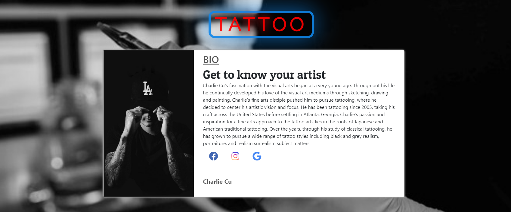
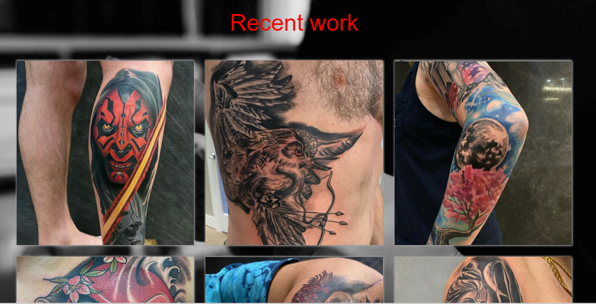

# Charlie Cu Tattoo
This application showcase the tattoo artist and his latest work.

## Licensing:

## User Story
You know exactly what you want your tattoo to be.  You just have a genius idea inside your head but you’re not sure how to even express what you want it to look like.  This application showcases the artist's latest work and style of tattoo.   It also has links to his social media and where he is located at.

#### Homepage

#### Work

#### Links
[Deployed application](https://anhcu.github.io/Charlie-Cu-Tattoo/
)
 
[Github repo](https://github.com/anhcu/Charlie-Cu-Tattoo)

